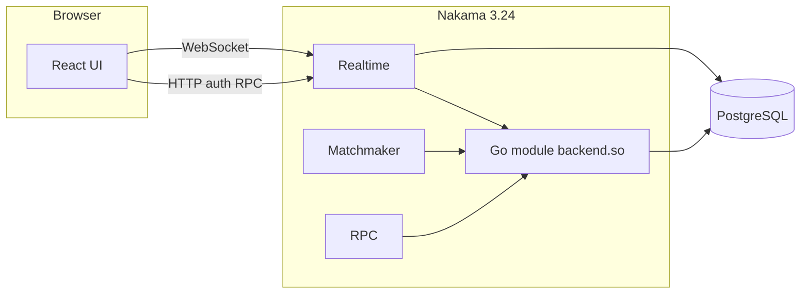

# Multiplayer Tic-Tac-Toe (Nakama + React)

Server-authoritative tic-tac-toe with matchmaking, optional **30s timed turns**, and a **global leaderboard** (wins / losses / draws / streak + score). The web client is **mobile-first** (React + Vite + TypeScript) and talks to Nakama over HTTP and WebSockets.

## Architecture



- **Authoritative logic** lives in [`server/main.go`](server/main.go): match state, move validation, win/draw/forfeit (leave / disconnect / timeout), and leaderboard updates.
- **Matchmaking**: clients queue with string property `mode` (`classic` | `timed`). `RegisterMatchmakerMatched` creates an authoritative match via `MatchCreate`.
- **Private rooms (Nakama)**: RPC `create_private_match` creates a match; the host shares `?match=<uuid>` or the raw match id; the friend calls `joinMatch`. Isolated from other matches (each match id is its own instance).
- **Client** never applies moves locally; it only renders the latest snapshot from opcode `1` and sends move requests on opcode `2`.

### Requirements checklist (Nakama path)

| Requirement | Status |
|-------------|--------|
| Server-authoritative state & move validation | Yes — `MatchLoop` in [`server/main.go`](server/main.go) |
| Anti-cheat (no client-trusted board) | Yes — only server applies moves |
| Broadcast validated state | Yes — opcode `1` snapshots |
| Create / join game rooms | Yes — private match RPC + `joinMatch`; matchmaking creates matches for random pairing |
| Automatic matchmaking | Yes — `addMatchmaker` + `RegisterMatchmakerMatched` |
| Room discovery / joining | Yes — invite link + paste match id; random queue for open pairing |
| Graceful disconnect | Yes — `MatchLeave` forfeit or `abandoned` if host alone leaves |
| Concurrent sessions | Yes — one Nakama match per game |
| Leaderboard (wins/losses/streak/score) | Yes — `LeaderboardRecordWrite` + RPC `leaderboard_top` |
| Timed mode (30s, forfeit on timeout) | Yes — `mode: timed` + tick loop |
| Deployment documentation | Yes — [`docs/DEPLOYMENT.md`](docs/DEPLOYMENT.md) |

## Prerequisites

- **Node.js 20+** (frontend + optional local game server)
- **Docker** + Docker Compose (only if you use the Nakama + Postgres stack)

## Local setup (no Docker)

Use the **Node WebSocket server** for full end-to-end play on one machine: human vs **minimax bot**, or human vs human using **two browser windows**.

1. Install and start the local server:

```bash
cd local-server
npm install
npm start
```

(Default: WebSocket `ws://127.0.0.1:8787` — `LOCAL_WS_PORT`; HTTP leaderboard `http://127.0.0.1:8788/leaderboard` — `LOCAL_HTTP_PORT`.)

Each **browser tab** gets its own player id via `sessionStorage`, so two windows with different nicknames are two distinct users (local or Nakama device auth).

2. Point the frontend at local mode (already the default in `frontend/.env`):

- `VITE_BACKEND=local`
- `VITE_LOCAL_WS_URL=ws://127.0.0.1:8787`

3. Run the UI:

```bash
cd frontend
npm install
npm run dev
```

Leaderboard and stats for local mode are **in-memory** (reset when the Node process restarts). Switch to Nakama by removing `VITE_BACKEND=local` (or setting it to anything other than `local`) and running Docker as below.

## Local setup

### 1. Backend (Nakama + Postgres)

From the repo root:

```bash
docker compose up --build
```

- **API / WebSocket**: `http://127.0.0.1:7350` (default `server_key`: `defaultkey`)
- **Console** (dev only): `http://127.0.0.1:7351` — default login in [`server/local.yml`](server/local.yml) (`admin` / `password`). **Disable or protect the console in production.**

The Go runtime plugin is built inside [`server/Dockerfile`](server/Dockerfile) with `heroiclabs/nakama-pluginbuilder` so the `.so` matches Linux Nakama even when you develop on Windows.

### 2. Frontend

```bash
cd frontend
cp .env.example .env
npm install
npm run dev
```

Then open the URL Vite prints (usually `http://127.0.0.1:5173`).

Environment variables (see [`frontend/.env.example`](frontend/.env.example)):

| Variable | Purpose |
|----------|---------|
| `VITE_NAKAMA_HOST` | Nakama hostname |
| `VITE_NAKAMA_PORT` | API port (default `7350`) |
| `VITE_NAKAMA_SERVER_KEY` | Server key (`defaultkey` in dev) |
| `VITE_NAKAMA_USE_SSL` | `true` when the page is served over HTTPS and Nakama uses TLS |

## How to test multiplayer

1. Start `docker compose up` and `npm run dev`.
2. Open **two** browser contexts (e.g. normal window + **InPrivate/Incognito**, or two machines on the same LAN pointing `VITE_NAKAMA_HOST` at your machine’s IP).
3. Enter **different nicknames**, choose the same **mode** (classic or timed), and click **Find match** on both.
4. Play a few moves; try invalid actions (wrong turn, occupied cell) — the board should not change.
5. Optional: **Leave room** mid-game — the opponent should win by forfeit and the leaderboard should update after the match.
6. **Nakama private room**: one player clicks **Private room**, copies the link; the other opens it or pastes the match UUID under **Join**.

## RPC

| ID | Description |
|----|-------------|
| `leaderboard_top` | Returns JSON array of top records (rank, `ownerId`, username, score, subscore, metadata). |
| `create_private_match` | Body: `{"mode":"classic"\|"timed"}`. Returns `{"matchId":"<uuid>"}`. The client then opens a socket and calls `joinMatch(matchId)` (handled in the web UI). |
| `create_bot_match` | Body: `{"mode":"classic"\|"timed"}`. Creates a match with a server-side minimax bot (`__bot__`). Returns `{"matchId":"<uuid>"}`; client connects and `joinMatch` as usual. |

## Deployment

Full guide (cloud providers, TLS, Postgres, static frontend, security checklist): **[`docs/DEPLOYMENT.md`](docs/DEPLOYMENT.md)**.

Summary: run Nakama + Postgres with the built module ([`server/Dockerfile`](server/Dockerfile)), terminate TLS in front of the API/WebSocket port, rotate `defaultkey`, then deploy `frontend/dist` with the correct `VITE_NAKAMA_*` variables.

## Project layout

| Path | Role |
|------|------|
| [`docker-compose.yml`](docker-compose.yml) | Postgres + Nakama image build |
| [`server/Dockerfile`](server/Dockerfile) | Builds `backend.so`, copies into Nakama image |
| [`server/local.yml`](server/local.yml) | Nakama runtime path, DB, console, server key |
| [`server/main.go`](server/main.go) | Match handler, matchmaker hook, leaderboard + RPCs (`create_private_match`, `create_bot_match`, …) |
| [`docs/DEPLOYMENT.md`](docs/DEPLOYMENT.md) | Production deployment documentation |
| [`frontend/`](frontend/) | Vite React client |

## Security notes (production)

- Replace `defaultkey`, console credentials, and DB password.
- Do not expose Nakama console publicly.
- Treat the server key as a secret; use HTTPS and WSS end-to-end.

## License

Apache-2.0 (Nakama sample module license applies to patterns derived from Heroic Labs examples).
