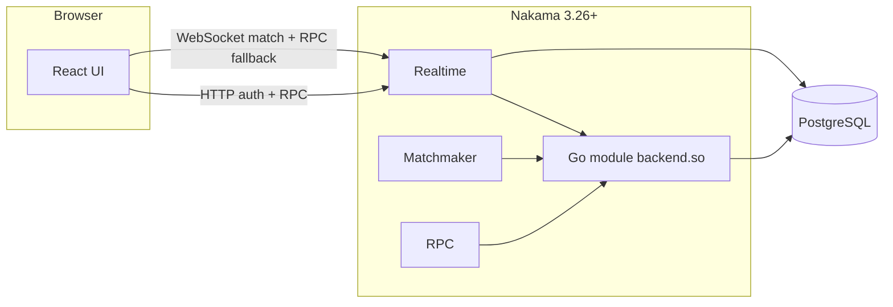

# Multiplayer Tic-Tac-Toe (Nakama + React)

Server-authoritative tic-tac-toe with matchmaking, optional **30s timed turns**, and a **global leaderboard** (wins / losses / draws / streak + score). The web client is **mobile-first** (React + Vite + TypeScript) and can use either **Heroic Labs Nakama** (production-style) or a **Node WebSocket server** for local development without Docker.

---

## Contents

- [Setup and installation](#setup-and-installation)
- [Architecture and design decisions](#architecture-and-design-decisions)
- [Deployment process](#deployment-process)
- [API and server configuration](#api-and-server-configuration)
- [How to test multiplayer](#how-to-test-multiplayer)
- [Project layout](#project-layout)
- [Security notes (production)](#security-notes-production)
- [License](#license)

---

## Setup and installation

### Prerequisites

| Tool | Used for |
|------|----------|
| **Node.js 20+** | Frontend (`frontend/`) and optional local game server (`local-server/`) |
| **Docker** + **Docker Compose** | Nakama + PostgreSQL stack (recommended for full multiplayer testing) |
| **Go** (optional) | Only if you build or edit [`server/main.go`](server/main.go) outside Docker |

---

### Path A — Local backend only (no Docker)

Use this for quick UI work, **Play vs Bot**, or **two browser tabs** on one machine (human vs human over the Node server).

1. **Start the local WebSocket server**

   ```bash
   cd local-server
   npm install
   npm start
   ```

   Defaults:

   - WebSocket: `ws://127.0.0.1:8787` (`LOCAL_WS_PORT` in [`local-server/server.mjs`](local-server/server.mjs))
   - Optional HTTP leaderboard: `http://127.0.0.1:8788` (`LOCAL_HTTP_PORT`)

2. **Configure the frontend for local mode**

   Copy [`frontend/.env.example`](frontend/.env.example) to `frontend/.env` and ensure:

   - `VITE_BACKEND=local`
   - `VITE_LOCAL_WS_URL=ws://127.0.0.1:8787`
   - `VITE_LOCAL_HTTP_URL=http://127.0.0.1:8788` (if you use HTTP leaderboard)

3. **Run the UI**

   ```bash
   cd frontend
   npm install
   npm run dev
   ```

   Open the URL Vite prints (usually `http://127.0.0.1:5173`).

**Note:** Local leaderboard and match state are **in-memory**; restarting `npm start` clears them.

---

### Path B — Nakama + PostgreSQL (Docker)

Use this to mirror production: device auth, matchmaker, authoritative Go module, and persistent leaderboard.

1. **From the repo root**

   ```bash
   docker compose up --build
   ```

   - **API + WebSocket:** `http://127.0.0.1:7350` (default server key: `defaultkey` — see [`server/local.yml`](server/local.yml))
   - **Console (dev only):** `http://127.0.0.1:7351` — default credentials in `local.yml` (`admin` / `password`). **Do not expose the console publicly in production.**

2. **Frontend env for Nakama**

   ```bash
   cd frontend
   cp .env.example .env
   ```

   Set **`VITE_BACKEND`** to anything **other than** `local` (e.g. remove the line or use `nakama`), then set:

   | Variable | Typical local value |
   |----------|------------------------|
   | `VITE_NAKAMA_HOST` | `127.0.0.1` |
   | `VITE_NAKAMA_PORT` | `7350` |
   | `VITE_NAKAMA_SERVER_KEY` | `defaultkey` (must match `socket.server_key` in Nakama config) |
   | `VITE_NAKAMA_USE_SSL` | `false` |

3. **Run the UI**

   ```bash
   npm install
   npm run dev
   ```

The Go runtime plugin is built inside [`server/Dockerfile`](server/Dockerfile) with `heroiclabs/nakama-pluginbuilder` so `backend.so` matches the Linux Nakama binary even when you develop on Windows or macOS.

---

### Production build (frontend)

```bash
cd frontend
npm ci
npm run build
```

Static assets are emitted to `frontend/dist/` for hosting behind any static file server or CDN.

---

## Architecture and design decisions

### High-level diagram



### Design choices

| Decision | Rationale |
|----------|-----------|
| **Server-authoritative state** | All board updates run in the Go match loop ([`server/main.go`](server/main.go)). The client **never** applies opponent moves by trusting local state; it renders the latest **snapshot** from the server. |
| **Anti-cheat** | Moves are **requests** (cell index). The server validates turn, legality, and mode (e.g. timed deadline) before mutating state. |
| **Two transport backends** | **`VITE_BACKEND=local`** uses the Node server in `local-server/` for fast iteration without Postgres. **Nakama** is the real deployment target with persistence and scale-out story. |
| **Device authentication** | Nakama `authenticateDevice` with a per-tab id (see client) gives guests a stable user id without a custom auth server. |
| **Matchmaking** | Clients call `addMatchmaker` with query `+properties.mode:classic|timed` and property `{ mode }`. `RegisterMatchmakerMatched` creates a new authoritative match via `MatchCreate`. |
| **Private rooms** | RPC `create_private_match` returns a `matchId`. The host **shares the match ID**; the friend pastes it under **Join game** on the home screen (no generated invite URL in the UI). |
| **Bot opponent** | `create_bot_match` creates a match with `vs_bot`; the module drives a minimax-style bot as player `__bot__`. |
| **Timed mode** | Server tick loop enforces ~30s per move; expiry ends the game with a documented reason (e.g. `turn_timeout`). |
| **RPC over WebSocket fallback** | Some Nakama versions had broken HTTP RPC path parsing; the client can call RPCs over the socket (see [`frontend/src/nakamaClient.ts`](frontend/src/nakamaClient.ts)). The Dockerfile pins **Nakama 3.26+** to avoid the HTTP RPC bug. |

### Realtime match protocol (Nakama)

| Opcode | Direction | Purpose |
|--------|-----------|---------|
| `1` | Server → clients | **Snapshot** — full match state JSON (board, players, turn, status, etc.) |
| `2` | Client → server | **Move** — JSON `{ "index": 0..8 }` |
| `3` | Server → clients | **Error** — JSON with `code` / `for` (user id) for client display |

---

## Deployment process

### Documentation map

- **This README** — overview, env vars, testing, and pointers.
- **[`docs/DEPLOYMENT.md`](docs/DEPLOYMENT.md)** — deep dive: TLS, managed Postgres, security checklist, CORS, smoke tests, troubleshooting (e.g. `RPC ID must be set` on old Nakama).

### Typical production shape

1. Run **PostgreSQL** (managed or container) reachable only from Nakama.
2. Run **Nakama** with the built **`backend.so`** module and a **non-default** `server_key`.
3. Terminate **TLS** in front of Nakama (e.g. Caddy/nginx) so browsers get **HTTPS/WSS** (`VITE_NAKAMA_USE_SSL=true`).
4. Deploy **`frontend/dist`** with **build-time** `VITE_*` variables pointing at the **public Nakama host** (hostname only, no `https://` in `VITE_NAKAMA_HOST`).

### Render.com (example)

[`render.yaml`](render.yaml) defines:

- A **Postgres** database and a **Docker** web service for Nakama (context `server/`, [`server/Dockerfile`](server/Dockerfile)).
- Env injection: `DB_*`, generated `NAKAMA_SERVER_KEY`, optional `LEADERBOARD_ID`.
- [`server/render-entrypoint.sh`](server/render-entrypoint.sh) patches `local.yml` into a runtime config (DSN, server key, `PORT`), runs migrations, then starts Nakama.
- A **static** site for the frontend with `VITE_NAKAMA_HOST` from the Nakama service, `VITE_NAKAMA_PORT=443`, `VITE_NAKAMA_USE_SSL=true`, and `VITE_NAKAMA_SERVER_KEY` synced from the backend.

After changing any `VITE_*` variable, **rebuild and redeploy** the frontend.

---

## API and server configuration

### Nakama endpoints (default local)

| Port | Service |
|------|---------|
| **7350** | gRPC/HTTP API + WebSocket (game + realtime) |
| **7351** | Developer console (disable or lock down in production) |

### Server config file (local Docker)

[`server/local.yml`](server/local.yml) includes:

- **`database.*`** — Postgres connection (overridden on Render via `render-entrypoint.sh` + `DB_*`).
- **`runtime.path`** — `/nakama/data/modules` where `backend.so` is mounted.
- **`runtime.env`** — e.g. `LEADERBOARD_ID` (default `tic_tac_toe_global`) for the Go module.
- **`session.token_expiry_sec`** — session lifetime.
- **`socket.server_key`** — must match the client’s `VITE_NAKAMA_SERVER_KEY`.

### Frontend environment variables

| Variable | Purpose |
|----------|---------|
| `VITE_BACKEND` | `local` = Node `local-server`; anything else (e.g. `nakama`) = Nakama client. |
| `VITE_LOCAL_WS_URL` | WebSocket URL for local server. |
| `VITE_LOCAL_HTTP_URL` | Optional HTTP base for local leaderboard. |
| `VITE_NAKAMA_HOST` | Nakama hostname **only** (no scheme, no path). |
| `VITE_NAKAMA_PORT` | API/WebSocket port as seen by the browser (often `443` behind TLS). |
| `VITE_NAKAMA_SERVER_KEY` | Must equal Nakama `socket.server_key`. |
| `VITE_NAKAMA_USE_SSL` | `true` when using `https`/`wss` to Nakama. |

### Registered RPCs (Go module)

| RPC ID | Request body | Response |
|--------|----------------|----------|
| `leaderboard_top` | `{}` (or empty) | JSON array of top leaderboard rows (rank, owner id, username, score, metadata: wins/losses/draws/streak). |
| `create_private_match` | `{"mode":"classic"\|"timed"}` | `{"matchId":"<uuid>"}` — client then `joinMatch(matchId)` over the socket. |
| `create_bot_match` | `{"mode":"classic"\|"timed"}` | `{"matchId":"<uuid>"}` — same join flow; server adds bot player `__bot__`. |

### Match registration (server)

The module registers the authoritative match handler name used by `MatchCreate` / matchmaker (see `RegisterMatch` in [`server/main.go`](server/main.go)).

---

## How to test multiplayer

### Nakama + Docker (`docker compose up` + `npm run dev`)

1. **Random matchmaking**  
   Open **two** isolated browser contexts (e.g. normal window + **Incognito/InPrivate**, or two devices on the LAN with `VITE_NAKAMA_HOST` pointing at your machine’s IP). Enter **different nicknames**, pick the **same mode** (Classic or Timed), click **Find match** on both. You should pair into one match.

2. **Move validation**  
   Try clicking out of turn or an occupied cell — the UI should **not** change the board; you may see an error or “not your turn” style feedback.

3. **Private room**  
   Player A: **Private room** → copy **Match ID**. Player B: paste the UUID in **Friend’s match ID** → **Join game**. Both should land in the same waiting/playing flow.

4. **Disconnect / forfeit**  
   Mid-game, use toolbar **restart/leave** or close the tab on one side; the other player should receive a win/forfeit or room closure according to server rules.

5. **Timed mode**  
   Select **Timed**, start a match, and confirm the countdown and that idle expiry ends the game with a timeout-style result.

6. **Leaderboard**  
   Finish a match and open **Leaderboard** in the toolbar; scores and W/L/D should update for human players (bot id `__bot__` is not shown as a normal user).

7. **Play vs Bot**  
   **Play vs Bot** from the home screen; complete a game and confirm behavior and leaderboard.

### Local Node server (`VITE_BACKEND=local`)

1. Start `local-server` and `frontend` as in [Path A](#path-a--local-backend-only-no-docker).
2. Open **two tabs**, **Continue** with two nicknames.
3. Use **Find match** (same mode) in both tabs to pair, or use **Create room** / **Join game** with the displayed room code.

### Automated tests

There is **no** bundled E2E suite in this repo; regression testing is **manual** via the flows above. For CI you can add `npm run build` in `frontend/` and `go build` / Docker build for `server/`.

---

## Project layout

| Path | Role |
|------|------|
| [`docker-compose.yml`](docker-compose.yml) | Local Postgres + Nakama image build |
| [`render.yaml`](render.yaml) | Example Render.com blueprint |
| [`server/Dockerfile`](server/Dockerfile) | Builds `backend.so`, Nakama runtime image |
| [`server/local.yml`](server/local.yml) | Base Nakama config (local + template for Render script) |
| [`server/render-entrypoint.sh`](server/render-entrypoint.sh) | Production-style env → config + migrate + start |
| [`server/main.go`](server/main.go) | Match loop, matchmaker hook, leaderboard, RPCs |
| [`local-server/`](local-server/) | Node WebSocket game server for dev |
| [`frontend/`](frontend/) | Vite + React client |
| [`docs/DEPLOYMENT.md`](docs/DEPLOYMENT.md) | Extended deployment guide |

---

## Requirements checklist (Nakama path)

| Requirement | Status |
|-------------|--------|
| Server-authoritative state & move validation | Yes — `MatchLoop` in [`server/main.go`](server/main.go) |
| Anti-cheat (no client-trusted board) | Yes |
| Broadcast validated state | Yes — opcode `1` snapshots |
| Create / join game rooms | Yes — private match RPC + `joinMatch`; matchmaking for random pairing |
| Automatic matchmaking | Yes — `addMatchmaker` + `RegisterMatchmakerMatched` |
| Room discovery / joining | Yes — **match ID** shared out-of-band; **Join game** on home screen |
| Graceful disconnect | Yes — `MatchLeave` forfeit / `abandoned` when host leaves alone |
| Concurrent sessions | Yes — one Nakama match id per game |
| Leaderboard | Yes — `LeaderboardRecordWrite` + RPC `leaderboard_top` |
| Timed mode (30s, forfeit on timeout) | Yes |
| Deployment documentation | Yes — [`docs/DEPLOYMENT.md`](docs/DEPLOYMENT.md) |

---

## Security notes (production)

- Replace **`defaultkey`**, console credentials, and database passwords.
- Do not expose the Nakama **console** (7351) to the public internet.
- Treat **`VITE_NAKAMA_SERVER_KEY`** as a public client secret — it must match the server but is visible in the built JS; for sensitive setups, use Nakama’s session and key rotation guidance.
- Use **TLS end-to-end** for production (`https` + `wss`).

---

## License

Apache-2.0 (Nakama sample module license applies to patterns derived from Heroic Labs examples).
