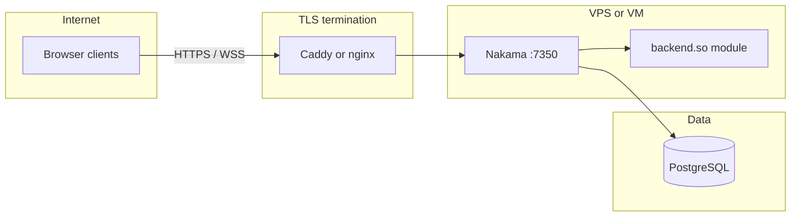

# Deployment guide: Nakama backend + React frontend

This document describes how to run **tic-tac-toe** in production with **Heroic Labs Nakama** (authoritative matches, matchmaking, leaderboard) and a static **Vite/React** frontend.

## What the Nakama module provides

| Area | Implementation |
|------|------------------|
| **Server-authoritative play** | Go match handler in [`server/main.go`](../server/main.go): board state, turn order, win/draw, rejects invalid moves and out-of-turn sends. |
| **Anti-cheat** | Clients only request moves; the server applies them after validation. |
| **State broadcast** | Snapshots on opcode `1` to all match participants. |
| **Matchmaking** | `addMatchmaker` from the client with `properties.mode` (`classic` \| `timed`); `RegisterMatchmakerMatched` creates a new authoritative match. |
| **Private rooms** | RPC `create_private_match` creates a match; friends join with `joinMatch(matchId)` via invite link `?match=<uuid>` or pasted ID. |
| **Play vs Bot (Nakama)** | RPC `create_bot_match` creates an authoritative match with params `vs_bot: true`; the module adds a synthetic player id `__bot__` and runs minimax in `MatchLoop`. |
| **Disconnects** | `MatchLeave` awards forfeit to the remaining player when one leaves mid-game; a lone host closing a private room sets status `abandoned` (no leaderboard write). |
| **Concurrent matches** | Each `MatchCreate` is an isolated Nakama match instance; many matches run in parallel. |
| **Leaderboard** | Global leaderboard ID (default `tic_tac_toe_global`): score + metadata (`wins`, `losses`, `draws`, `streak`). RPC `leaderboard_top` returns top rows. |
| **Timed mode** | 30s per move; server tick ends the game with `turn_timeout` forfeit. |

## Architecture (production)



## 1. Database (PostgreSQL)

Use a managed database (AWS RDS, DigitalOcean Managed DB, Google Cloud SQL, Azure Database for PostgreSQL) or a Postgres container on the same host as Nakama.

- Create a database and user for Nakama.
- Note: **host**, **port**, **database name**, **user**, **password**.
- Allow inbound connections from the Nakama host only (security group / firewall).

## 2. Nakama server + Go module

The repo builds the runtime plugin in Linux inside Docker (see [`server/Dockerfile`](../server/Dockerfile)) so `backend.so` matches the Nakama binary.

### Option A: Docker Compose on a VPS (DigitalOcean, AWS Lightsail, Linode, etc.)

1. Copy this repository to the server.
2. Edit a **production** YAML (do **not** use [`server/local.yml`](../server/local.yml) as-is): set `database.address`, strong credentials, disable or lock down the **console** (`7351`), and replace `defaultkey` with a secret server key.
3. Build and run (example pattern):

```bash
docker compose -f docker-compose.prod.yml up -d --build
```

Use [`docker-compose.yml`](../docker-compose.yml) as a template; point `database.address` at your managed Postgres if it is not the bundled `postgres` service.

4. Open firewall: **7350** (API + WebSocket) only from your reverse proxy (or from the internet if you terminate TLS inside Nakama). Prefer **not** exposing **7351** publicly.

### Option B: Kubernetes / cloud container services

- Run the same Nakama image you build from `server/Dockerfile`.
- Inject DB URL and config via secrets and ConfigMaps.
- Use a managed Postgres as the datastore.

### TLS (required for HTTPS sites)

Browsers on **HTTPS** require **WSS** to Nakama. Terminate TLS with **Caddy** or **nginx** + Let’s Encrypt in front of port **7350**, or use a load balancer with a certificate.

Point your frontend env vars at the **public hostname** and set `VITE_NAKAMA_USE_SSL=true` when the API is served over HTTPS.

## 3. Frontend (static hosting)

Build:

```bash
cd frontend
npm ci
npm run build
```

Deploy the `frontend/dist` folder to **Netlify**, **Vercel**, **Cloudflare Pages**, **AWS S3 + CloudFront**, or similar.

Set these **build-time** variables in the host dashboard (names must match `VITE_*` in [`frontend/.env.example`](../frontend/.env.example)):

| Variable | Example | Purpose |
|----------|---------|---------|
| `VITE_NAKAMA_HOST` | `nakama.example.com` | **Nakama** API hostname only — not your static frontend URL, no `https://` prefix |
| `VITE_NAKAMA_PORT` | `443` or `7350` | Port exposed through the proxy |
| `VITE_NAKAMA_SERVER_KEY` | *(secret)* | Must match Nakama `server_key` |
| `VITE_NAKAMA_USE_SSL` | `true` | When using HTTPS/WSS |
| `VITE_BACKEND` | unset or not `local` | Use Nakama instead of the Node local server |

Redeploy after changing any `VITE_*` value.

### RPC errors (`RPC ID must be set`)

Symptoms: `POST /v2/rpc/create_private_match` returns **400** even though the RPC name is in the URL.

**Server bug (fixed in newer Nakama):** Nakama **3.24.x** read the RPC id with `http.Request.PathValue("id")` while the route is registered on **gorilla/mux** (`/v2/rpc/{id:.*}`). `PathValue` stays empty, so **every** HTTP RPC fails with this message. **Use Nakama 3.26+** (this repo’s `server/Dockerfile` sets `NAKAMA_VERSION` accordingly). Rebuild and redeploy the Nakama Docker service after changing it.

Other client/env causes:

- **`VITE_NAKAMA_HOST` is wrong** — it must be the **Nakama API** hostname, **not** the static frontend host.
- **Scheme baked into the host** — use `nakama.example.com`, not `https://nakama.example.com`.
- **Reverse proxy** strips or rewrites `/v2/rpc/<id>`.
- **`VITE_NAKAMA_SERVER_KEY` ≠ Nakama `server_key`**.

Quick checks: DevTools → Network: URL host is Nakama, path includes the RPC id, response is JSON not HTML.

## 4. CORS and browser access

If the browser calls Nakama HTTP from a different origin, configure Nakama to allow your frontend origin (see [Nakama configuration](https://heroiclabs.com/docs/nakama/concepts/multiplayer/#session-management) and deployment notes for your version).

## 5. Security checklist

- [ ] Replace **`defaultkey`** with a long random server key; store only in secrets.
- [ ] Strong Postgres password; DB not exposed to the public internet.
- [ ] Nakama **console** disabled in production or protected by VPN / allowlist.
- [ ] TLS for all client ↔ Nakama traffic in production.
- [ ] Regular backups of PostgreSQL.

## 6. Smoke tests after deploy

1. Open the deployed frontend; set nickname (device auth).
2. **Find match** in two separate browsers (or incognito); complete a game.
3. **Private room**: create room, copy link, open in second browser; verify both play.
4. **Timed mode**: enable timed mode, confirm countdown and timeout forfeit.
5. Call RPC **`leaderboard_top`** (or open in-app leaderboard) and confirm rows update.
6. **Play vs Bot**: use **`create_bot_match`** from the UI; finish a game and confirm the leaderboard does not list the bot user id (`__bot__`).

## 7. Mobile / PWA

The client is a responsive web app. For distribution as an installable app, add a Web App Manifest and service worker (optional; not included by default). Users can also “Add to Home Screen” from the browser.

## Support references

- [Nakama Docker install](https://heroiclabs.com/docs/nakama/getting-started/install/docker/)
- [Nakama Go runtime](https://heroiclabs.com/docs/nakama/server-framework/go-runtime/)
